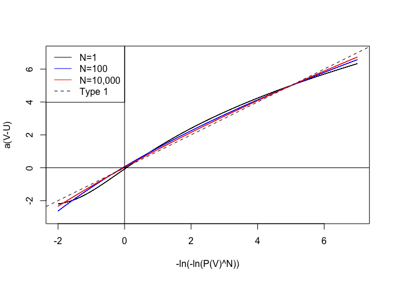

# Convergence of n-block maxima with Weibull parents distributions to Type 1 asymptotes

Demonstration of convergence of n-block maxima from a Weibull parent
distribution to a Fisher–Tippett Type 1 (Gumbel) asymptote. Replicating
Fig.~1 of Cook (1982) *Towards better estimation of extreme winds*.

First, choose a shape parameter (`k=2` for Rayleigh, `k=1` for
exponential).

``` r
k <- 2 
```

We want the ordinate to be *y* to be the same for all plots so define
this first. We define the probability from this, so we are sampling the
same probabilities from each of the *n*-block maxima distributions.
Here, *y* represents to −log (−log (*P*(*V*))) or
−log (−log (*P*(*V*)<sup>*n*</sup>)), depending which variable we are
plotting.

``` r
y <- seq(-2, 7, length.out=10000)
p <- exp(-exp(-y))
```

Since we can only sample from the (Weibull) parent distribution, we use
Eq.~(6) from Cook (1982),

$$
P(x) =  P_n(x)^{\frac{1}{n}}
$$

where *P*(*x*) is the Weibull parent CDF and *P*<sub>*n*</sub>(*x*) is
the CDF over *n*-block maxima. So we sample from the parent distribution
and the distributions of 100- and 10,000-block maxima according to:

``` r
v <- qweibull(p, shape=2)
v100 <- qweibull(p^(1/100), shape=2)
v10k <- qweibull(p^(1/10000), shape=2)
```

Cook (1982) used Lieblin’s \`\`best linear unbiased estimators’’ (BLUE)
to get the lines of best fit for each set of samples, but we will just
use linear regression for (Eq.~(3)),

$$
V = U + \frac{1}{a}y,
$$
i.e., intercept *U* and slope 1/*a*, for the samples from the parent and
n-block maxima.

``` r
fit1 <- lm(v ~ y)
U <- coef(fit1)[[1]]
a <- 1/coef(fit1)[[2]]

fit100 <- lm(v100 ~ y)
U100 <- coef(fit100)[[1]]
a100 <- 1/coef(fit100)[[2]]

fit10k <- lm(v10k ~ y)
U10k <- coef(fit10k)[[1]]
a10k <- 1/coef(fit10k)[[2]]
```

Plot the results.

``` r
plot(y, a * (v - U), type="l", xlim=c(-2, 7), ylim=c(-3, 7), xlab="-ln(-ln(P(V)^N))", ylab="a(V-U)")
lines(y, a100 * (v100 - U100), col="blue")
lines(y, a10k * (v10k - U10k), col="red")

legend("topleft",
       legend = c("N=1", "N=100", "N=10,000", "Type 1"),
       col = c("black", "blue", "red", "black"),
       lty = c(1, 1, 1, 2),
       lwd = c(1, 1, 1, 1))

abline(h=0);abline(v=0);abline(a=0, b=1, lty=2)
```



#### References

1.  Cook, N.J. (1982). Towards better estimation of extreme winds.
    *Journal of Wind Engineering and Industrial Aerodynamics*, 9,
    295–323
